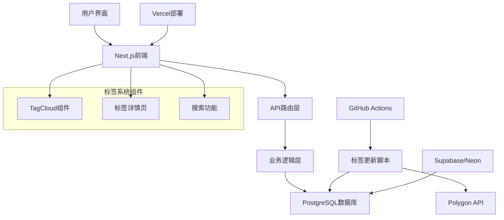

# 智能标签系统文档中心

## 📋 文档概述

欢迎来到美股热力图项目智能标签系统的文档中心。本目录包含了标签系统从产品规划到技术实现的完整文档体系，为产品经理、开发者、测试人员和运维人员提供全面的指导。

**项目状态**: ✅ 开发完成，已部署到生产环境  
**当前版本**: V1.0  
**最后更新**: 2025年1月9日  

---

## 📚 文档目录

### 🎯 产品文档

#### [产品需求文档 (PRD)](./TAGGING_SYSTEM_PRD.md)
**适用人群**: 产品经理、项目经理、开发团队  
**内容概要**: 
- 产品愿景和目标
- 用户需求分析
- 功能规格说明
- 成功指标定义
- 实施计划和风险评估

**核心亮点**:
- 🏷️ 静态标签分类（行业、市值、指数成分）
- 🔄 动态标签计算（52周新高/低、近期强势/弱势）
- 🎨 智能标签云展示
- 📊 标签详情页和统计分析

---

### 🏗️ 技术文档

#### [技术架构文档](./TECHNICAL_ARCHITECTURE.md)
**适用人群**: 架构师、高级开发者、技术负责人  
**内容概要**:
- 系统架构设计
- 数据库设计详解
- API接口规范
- 前端组件架构
- 自动化系统设计

**技术栈**:
- **前端**: Next.js + React + CSS Modules
- **后端**: Node.js + PostgreSQL
- **部署**: Vercel + Supabase/Neon
- **自动化**: GitHub Actions + Cron Jobs

#### [API接口文档](./API_DOCUMENTATION.md)
**适用人群**: 前端开发者、API集成开发者  
**内容概要**:
- 完整API接口列表
- 请求/响应格式说明
- 错误处理机制
- 使用示例和最佳实践

**核心接口**:
- `GET /api/tags` - 获取所有标签
- `GET /api/tags/{tagName}` - 获取标签详情
- `GET /api/stocks/tags` - 获取股票标签
- `GET /api/stocks/search` - 标签搜索股票

---

### 🚀 运维文档

#### [部署指南](./DEPLOYMENT_GUIDE.md)
**适用人群**: DevOps工程师、系统管理员  
**内容概要**:
- 生产环境部署流程
- 数据库配置和迁移
- 环境变量设置
- 监控和维护指南

**部署环境**:
- **应用托管**: Vercel (自动部署)
- **数据库**: PostgreSQL (Supabase推荐)
- **域名**: 自定义域名支持
- **监控**: 内置健康检查 + 外部监控

---

### 💻 开发文档

#### [开发指南](./DEVELOPMENT_GUIDE.md)
**适用人群**: 前端/后端开发者、新团队成员  
**内容概要**:
- 本地开发环境搭建
- 代码结构和规范
- 测试策略和方法
- 贡献流程和最佳实践

**开发环境**:
- **Node.js**: 18+
- **数据库**: PostgreSQL 14+ (本地/Docker/云端)
- **包管理**: npm/yarn
- **代码质量**: ESLint + Prettier

---

## 🚀 快速开始

### 对于产品经理

1. **了解产品**: 阅读 [产品需求文档](./TAGGING_SYSTEM_PRD.md)
2. **查看进展**: 检查功能实现状态和成功指标
3. **规划迭代**: 基于用户反馈制定下一版本计划

### 对于开发者

1. **环境搭建**: 按照 [开发指南](./DEVELOPMENT_GUIDE.md) 配置本地环境
2. **理解架构**: 阅读 [技术架构文档](./TECHNICAL_ARCHITECTURE.md)
3. **API集成**: 参考 [API文档](./API_DOCUMENTATION.md) 进行开发
4. **代码贡献**: 遵循开发指南中的贡献流程

### 对于运维人员

1. **部署应用**: 按照 [部署指南](./DEPLOYMENT_GUIDE.md) 进行生产部署
2. **监控系统**: 配置健康检查和性能监控
3. **维护数据**: 定期备份和性能优化

---

## 🎯 系统特性

### ✨ 核心功能

| 功能模块 | 描述 | 状态 |
|----------|------|------|
| 🏷️ 静态标签 | 行业分类、市值分组、指数成分 | ✅ 已完成 |
| 🔄 动态标签 | 52周新高/低、近期强势/弱势、高ROE等 | ✅ 已完成 |
| 🎨 标签云组件 | 智能标签展示，支持相关度可视化 | ✅ 已完成 |
| 📊 标签详情页 | 标签下股票列表，支持排序和分页 | ✅ 已完成 |
| 🔍 标签搜索 | 多标签组合搜索，支持AND/OR逻辑 | ✅ 已完成 |
| ⚡ 自动更新 | 定时计算动态标签，GitHub Actions | ✅ 已完成 |
| 📱 响应式设计 | 移动端适配，深色模式支持 | ✅ 已完成 |

### 🔧 技术特性

- **高性能**: 数据库索引优化，API响应缓存
- **可扩展**: 模块化设计，易于添加新标签类型
- **可靠性**: 错误处理机制，自动故障恢复
- **可维护**: 完整的日志记录，监控告警
- **安全性**: 参数验证，SQL注入防护

---

## 📊 系统架构概览

---

## 📈 数据流程

### 静态标签流程
1. **数据初始化**: 通过SQL脚本预设行业、市值等分类标签
2. **股票关联**: 基于股票基本信息自动关联相应标签
3. **前端展示**: 通过API获取并在标签云中展示

### 动态标签流程
1. **定时触发**: GitHub Actions每日美股收盘后执行
2. **数据获取**: 从Polygon API获取最新股价和财务数据
3. **标签计算**: 根据预定义规则计算各种动态标签
4. **数据更新**: 批量更新数据库中的标签关联关系
5. **结果通知**: 记录更新日志，发送监控通知

---

## 🔄 版本历史

### V1.0 (2025-01-09) - 初始版本

**新增功能**:
- ✅ 完整的标签系统架构
- ✅ 静态和动态标签分类
- ✅ 标签云组件和详情页
- ✅ 自动化标签更新流程
- ✅ 完整的API接口
- ✅ 响应式UI设计

**技术实现**:
- ✅ PostgreSQL数据库设计
- ✅ Next.js前端框架
- ✅ GitHub Actions自动化
- ✅ Vercel部署配置

### V1.1 (计划中)

**计划功能**:
- 🔄 标签订阅和通知
- 🔄 自定义标签创建
- 🔄 标签推荐算法
- 🔄 标签分析洞察

---

## 🎯 成功指标

### 产品指标
- **用户参与度**: 标签点击率 > 15%
- **页面停留**: 标签详情页平均停留时间 > 2分钟
- **搜索使用**: 标签搜索功能使用率 > 10%
- **数据准确性**: 动态标签计算准确率 > 95%

### 技术指标
- **API性能**: 平均响应时间 < 200ms
- **系统可用性**: 正常运行时间 > 99.5%
- **数据更新**: 标签更新成功率 > 99%
- **错误率**: API错误率 < 1%

---

## 🤝 团队协作

### 角色分工

| 角色 | 职责 | 主要文档 |
|------|------|----------|
| 产品经理 | 需求定义、功能规划 | PRD文档 |
| 架构师 | 技术架构设计 | 技术架构文档 |
| 前端开发 | UI组件实现 | 开发指南、API文档 |
| 后端开发 | API接口开发 | 开发指南、技术架构 |
| DevOps | 部署运维 | 部署指南 |
| 测试工程师 | 质量保证 | 开发指南（测试部分） |

### 沟通渠道

- **需求讨论**: 产品需求文档评审
- **技术方案**: 架构设计文档评审
- **代码审查**: GitHub Pull Request
- **问题跟踪**: GitHub Issues
- **部署协调**: 部署指南和运维文档

---

## 📞 支持和反馈

### 获取帮助

1. **查阅文档**: 首先查看相关文档是否有解答
2. **搜索Issues**: 在GitHub Issues中搜索类似问题
3. **提交Issue**: 如果问题未解决，创建新的Issue
4. **联系团队**: 通过内部沟通渠道联系相关负责人

### 反馈渠道

- **功能建议**: 通过产品需求文档反馈渠道
- **Bug报告**: GitHub Issues
- **文档改进**: Pull Request或Issue
- **性能问题**: 运维监控告警

### 文档维护

- **更新频率**: 功能变更时同步更新
- **版本控制**: 与代码版本保持一致
- **审查流程**: 文档变更需要相关团队审查
- **质量标准**: 保持文档的准确性和时效性

---

## 🔗 相关链接

### 项目资源
- **GitHub仓库**: [heatmap-pro](https://github.com/your-org/heatmap-pro)
- **生产环境**: [https://your-domain.vercel.app](https://your-domain.vercel.app)
- **API文档**: [在线API文档](https://your-domain.vercel.app/api-docs)
- **监控面板**: [系统监控](https://your-monitoring-url.com)

### 外部依赖
- **Polygon API**: [https://polygon.io](https://polygon.io)
- **Vercel平台**: [https://vercel.com](https://vercel.com)
- **Supabase**: [https://supabase.com](https://supabase.com)
- **GitHub Actions**: [https://github.com/features/actions](https://github.com/features/actions)

---

**文档维护**: 产品开发团队  
**最后更新**: 2025年1月9日  
**文档版本**: V1.0  

---

*💡 提示: 建议将此文档加入浏览器书签，作为标签系统开发和维护的快速入口。*